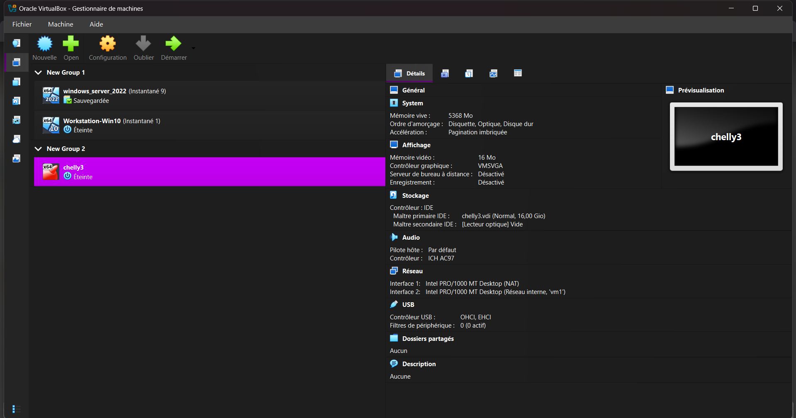
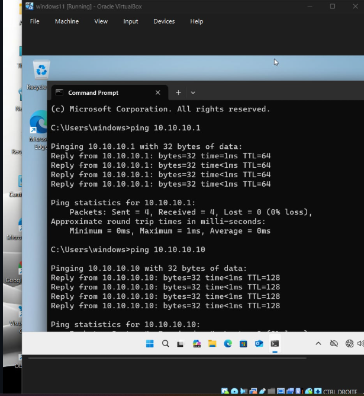
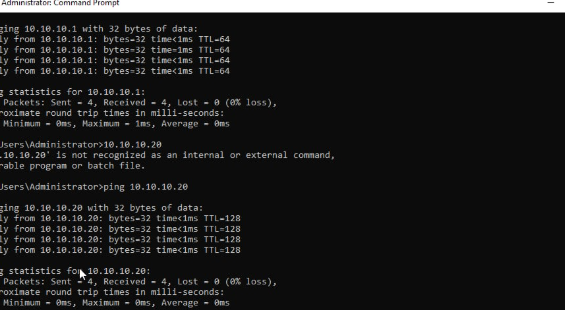

# Phase 1: Setup and Connectivity

## The Starting Point

Before anything else could happen — before Active Directory, before firewalls, before any security policy — we needed a working lab environment. The goal of this phase was simple: get three machines running, connected, and talking to each other.

We chose **Oracle VirtualBox** as our hypervisor. It's free, it supports snapshots (which saved us more than once), and it gives us full control over the virtual network.

---

## Building the Lab

We created three virtual machines, each with a specific role in the infrastructure:

| VM Name | Role | OS |
|---|---|---|
| windows_server_2022 | Domain Controller | Windows Server 2022 |
| Workstation-Win10 | Client Endpoint | Windows 10 |
| chelly3 | Firewall / IDS | OPNsense 25.7 (amd64) |

The network design put **OPNsense in the middle** — one interface facing the simulated internet (WAN via VirtualBox NAT), and one facing the internal lab network (LAN). Every internal VM connects through OPNsense, which is exactly how a real enterprise perimeter works.

```
[WAN - VirtualBox NAT - 10.0.2.15/24]
              |
       [OPNsense chelly3]
       LAN: 192.168.1.1/24
              |
   [Internal Network: 192.168.1.0/24]
        |              |
  [Windows Server]  [Win10 Workstation]
```

---

## Bringing It to Life

Once the VMs were created, we installed the operating systems and configured the network adapters:

- OPNsense was given two adapters: **Adapter 1 = NAT** (WAN), **Adapter 2 = Internal Network** (LAN)
- The Domain Controller and Workstation were each given one adapter on the same **Internal Network**
- We set the OPNsense LAN IP statically to `192.168.1.1/24`, making it the gateway for all internal machines
- The Domain Controller was assigned a static IP within the `192.168.1.0/24` range
- The Workstation received its IP from OPNsense's DHCP

We then verified connectivity by pinging across all three machines. To test this, we opened a Command Prompt on the workstation and pinged the Domain Controller and the OPNsense gateway. Every machine responded with successful replies — no packet loss, all reachable. DNS also resolved correctly once the DC was promoted in Phase 2 — but that comes next.

---

## Screenshots

### VirtualBox VM Manager — All Three VMs Running


*The VirtualBox manager showing all three VMs configured: the Domain Controller (windows_server_2022), the client workstation (Workstation-Win10), and the OPNsense firewall (chelly3).*

---

### Connectivity Test — Ping Between Machines


*Command Prompt showing successful ping replies between internal VMs — confirming the internal network is fully connected and all machines can reach each other through OPNsense.*

---



*Additional connectivity verification — all packets received with no loss, confirming stable routing across the 192.168.1.0/24 subnet.*

---

## What This Phase Gave Us

By the end of Phase 1, we had a fully connected virtual lab with a realistic enterprise topology. The firewall was up, internal machines could reach each other, and NAT was giving us simulated internet access through the WAN interface. The foundation was set for everything that came after.
