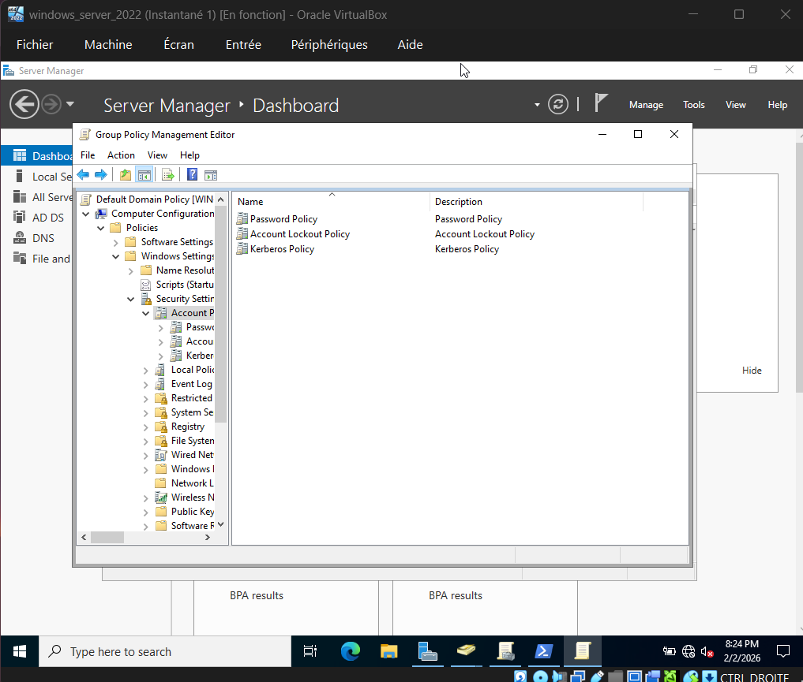
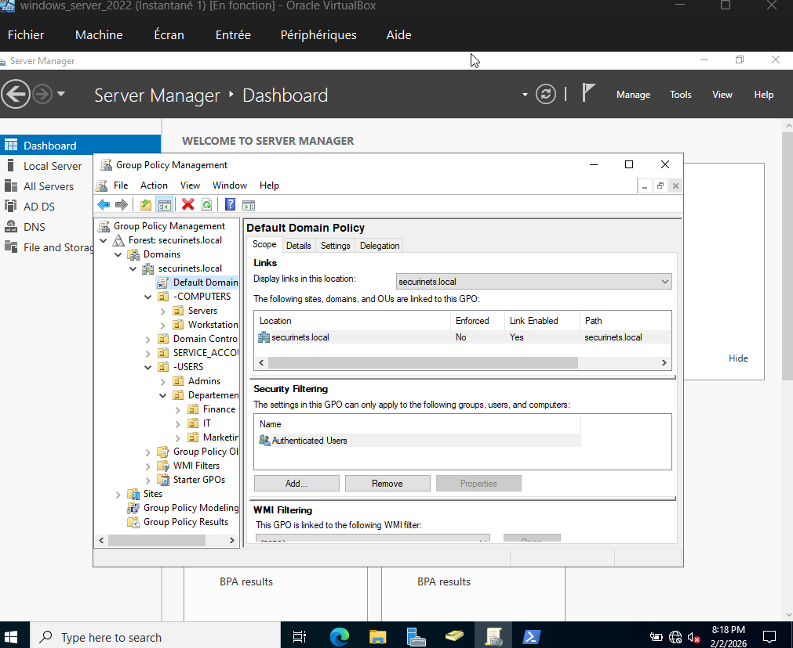
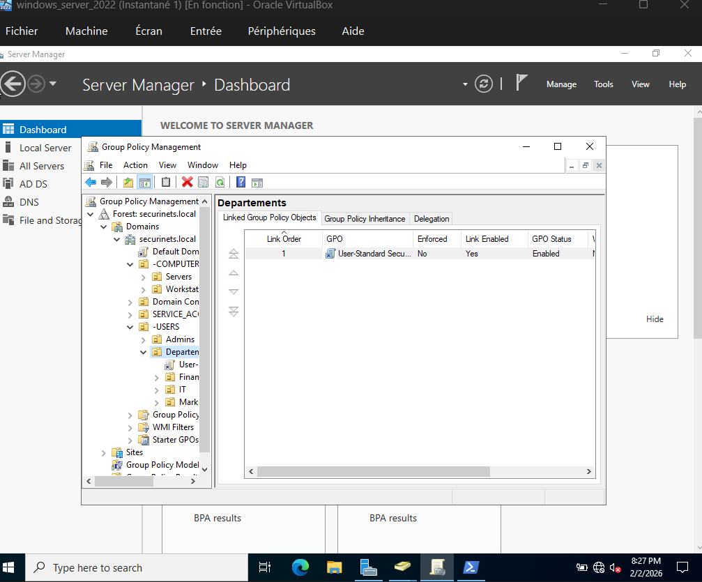
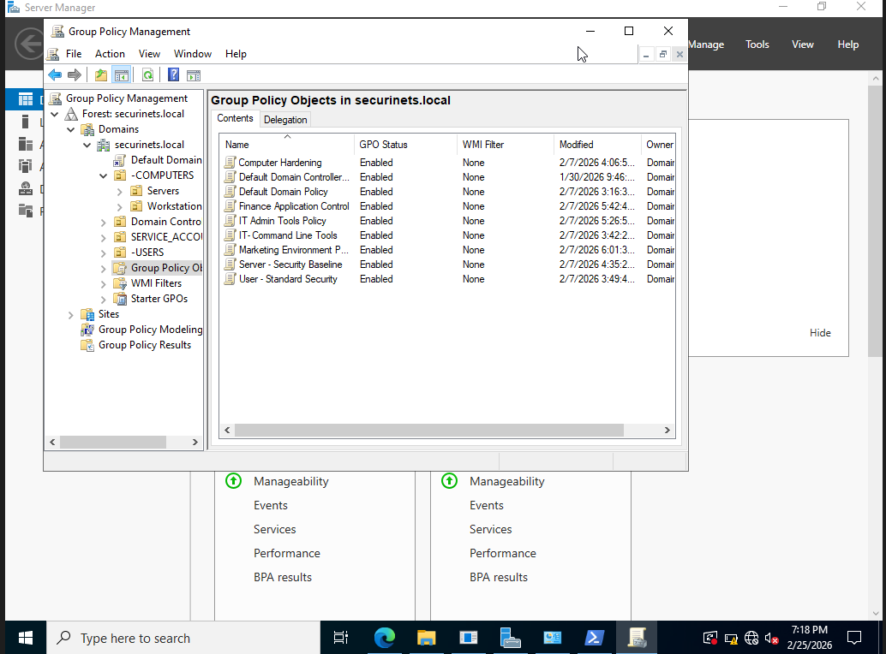

# Phase 2: Core Active Directory & Services

## Building the Identity Layer

With the network up and running, the next step was to give our infrastructure its identity. In any enterprise environment, **Active Directory** is the backbone — it controls who can log in, what they can access, and how machines behave. We needed to build that from scratch.

We started by promoting the Windows Server 2022 VM to a **Domain Controller** and creating our domain: `securinetsenit.local`.

---

## Designing the OU Structure

Before creating a single user, we sat down and designed the **Organizational Unit (OU) structure**. This matters because GPOs are applied based on where objects live in the directory — and delegation of control follows the same logic. We needed a structure that was clean, logical, and scalable.

We landed on this:

```
securinetsenit.local
├── _SERVICE_ACCOUNTS       ← Isolated service accounts, nothing else touches this OU
├── COMPUTERS
│   ├── Workstations        ← All domain-joined client machines
│   └── Servers             ← DC and any future servers
└── USERS
    ├── Admins
    │   ├── DomainAdmins    ← Full domain control
    │   └── Technical Team  ← IT operations, server and GPO management
    └── Departments
        ├── Finance
        ├── Marketing
        └── IT
```

Each department gets its own OU so we can apply policies specifically to them — Finance users don't get the same GPO as IT staff, and workstations don't get user policies mixed in.

---

## Delegation of Control

Rather than giving every admin full domain rights, we followed the **Principle of Least Privilege**. Each group only gets what they need:

| Group | Where | What They Can Do |
|---|---|---|
| DomainAdmins | Entire domain | Everything — schema, DC management, GPO linking |
| Technical Team | Servers OU + IT OU | Manage server objects, reset accounts, apply IT GPOs |
| Finance Department | Finance OU | Access financial shares, use department GPOs |
| Marketing Department | Marketing OU | Access marketing drives, standard security GPOs |
| IT Department | IT OU | Elevated workstation management, network config |
| Workstations OU Users | Workstations OU | Standard logon — no admin rights |

---

## Configuring Group Policy Objects

This was the most hands-on part of the phase. We created GPOs for each layer of the infrastructure and linked them to the right OUs. Here's the story of how each one came together.


### Default Domain Policy — The Baseline for Everyone

The first thing we configured was the domain-wide baseline. This GPO applies to every user and computer in `securinetsenit.local`, so we kept it focused on two things: **passwords and Kerberos**.

We opened the Group Policy Management Editor on the Default Domain Policy and configured:
- Password complexity: **enabled**
- Minimum length: **14 characters**
- Maximum age: **45 days**
- Account lockout: **5 failed attempts**
- Kerberos ticket lifetime: **10 hours**

These are non-negotiable. Every account in the domain inherits these settings.


*Server Manager showing the Group Policy Management console with the Default Domain Policy, Account Lockout Policy, and Kerberos Policy all visible.*


*The Default Domain Policy linked at the domain root — its scope covers every user and computer in securinetsenit.local.*


*Password policy settings inside the Default Domain Policy — complexity, minimum length, and maximum age enforced across the entire domain.*

---

### User - Standard Security — Locking Down the Departments

Next, we created a GPO that targets department users specifically — Finance, Marketing, and IT. The idea here was to enforce a consistent security baseline across all non-admin employees.

We linked this GPO to the `USERS/Departments` OU and configured:
- Screen lock after **10 minutes idle**
- Control Panel access **disabled** (for Finance and Marketing)
- A forced **corporate desktop background**
- Command-line tools **blocked** for non-IT users


*The User-Standard Security GPO linked to the Departments OU — locking down the interface for standard users while keeping IT staff functional.*

---

### Departments OU — Confirming GPO Links

After creating all the department-level policies, we opened the Departments OU in Group Policy Management to confirm everything was linked correctly. Finance, Marketing, and IT each had their own GPOs applied — no cross-contamination.


*The Departments OU showing all GPOs correctly linked to each sub-OU — Finance, Marketing, and IT each isolated with their own policy.*

---


## What This Phase Gave Us

By the end of Phase 2, `securinetsenit.local` was a fully functional Active Directory domain. Every user, computer, and group had a place in the directory. Policies were enforced. Delegation was scoped correctly. The workstation picked up all its GPOs on login and behaved exactly as designed.

The identity and access control layer of the infrastructure was complete.


*The final state — all 9 GPOs created and enabled in `securinetsenit.local`: Computer Hardening, Default Domain Controllers Policy, Default Domain Policy, Finance Application Control, IT Admin Tools Policy, IT Command Line Tools, Marketing Environment Policy, Server Security Baseline, and User Standard Security.*
