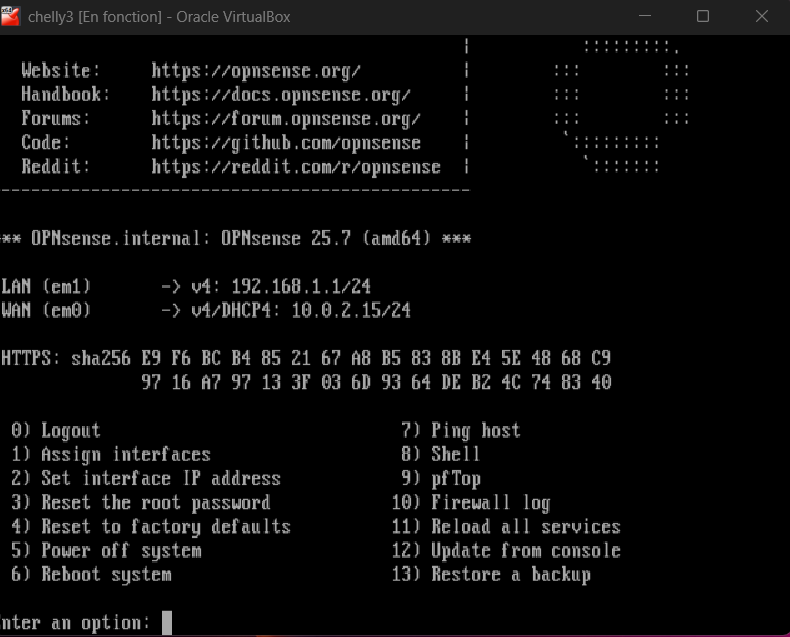
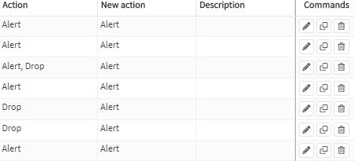
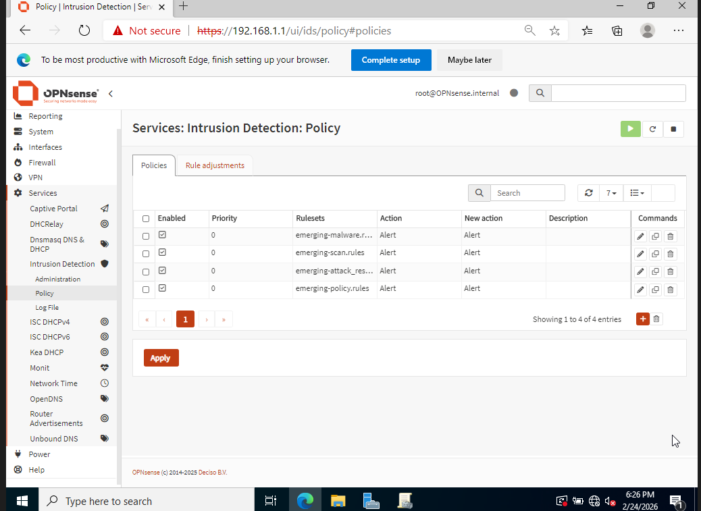
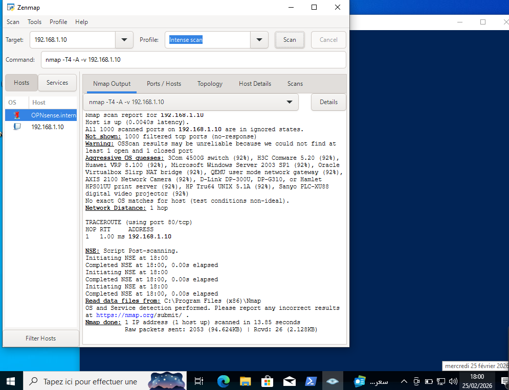
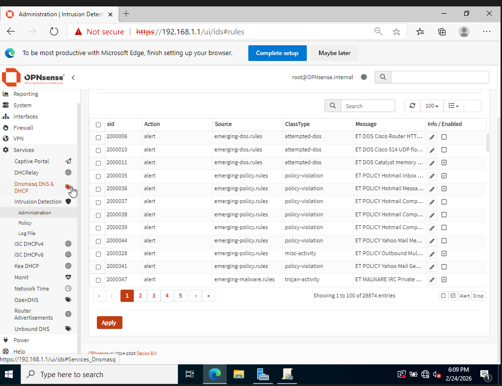

# Phase 3: Perimeter Defense & Hardening

## Putting a Wall Around the Network

The domain was running, users were configured, GPOs were enforced — but there was nothing stopping malicious traffic from flowing freely across the network. Phase 3 was about changing that by deploying a proper perimeter: **OPNsense** as the firewall, and **Suricata** as the intrusion detection and prevention engine.

The plan was to go through three stages:
1. Get OPNsense up and configured as the network gateway
2. Enable Suricata in **IDS mode** (alert only — watch but don't block)
3. Generate real traffic with **nmap**, see it get detected
4. Switch to **IPS mode** and watch the traffic get blocked

---

## Step 1: Installing OPNsense and Configuring the Interfaces

We installed OPNsense 25.7 on the `chelly3` VM in VirtualBox. Before even booting into the installer, we had to set up the VM's network adapters correctly:

- **Adapter 1 (em0)** was set to **NAT** in VirtualBox — this becomes the WAN interface, simulating an internet uplink
- **Adapter 2 (em1)** was set to **Internal Network** in VirtualBox — this becomes the LAN interface, connecting to the same internal segment as the DC and workstation

After installation, OPNsense boots into a console menu. The first thing it asks is to assign the interfaces. We mapped them as follows:

- `em0` → **WAN** (no manual IP needed — configured to get its address via DHCP from VirtualBox NAT, which assigned it `10.0.2.15/24`)
- `em1` → **LAN** (we assigned this a static IP of `192.168.1.1/24` — this is the gateway address that all internal machines point to)

Once the interfaces were assigned, we accessed the OPNsense web interface from the Windows workstation by navigating to `https://192.168.1.1` in a browser. From there, the full configuration happens through a GUI.

Inside the web interface, we verified and finalized the interface settings:

- **WAN (em0)**: IPv4 via DHCP → received `10.0.2.15/24` from VirtualBox NAT. Outbound NAT was automatically configured, allowing internal machines to reach the simulated internet through OPNsense
- **LAN (em1)**: Static IPv4 `192.168.1.1/24`. OPNsense's built-in DHCP server was enabled on this interface, so the workstation automatically received an IP in the `192.168.1.0/24` range on boot

We also set the DC's IP statically within the same subnet so it would always be reachable at a fixed address for DNS and AD operations.

From this point on, all traffic between the internal VMs and the outside world passes through OPNsense. The firewall was live.


*The OPNsense console confirming the final interface assignment — LAN (em1) at 192.168.1.1/24, WAN (em0) at 10.0.2.15/24 via DHCP. Both interfaces up and routing traffic.*

---

## Step 2: Enabling Suricata in IDS Mode

With the firewall running, we navigated to **Services > Intrusion Detection** in the OPNsense web interface and enabled Suricata on the LAN interface. We loaded the **Emerging Threats** ruleset — a widely used, regularly updated collection of signatures covering a broad range of attack patterns and policy violations.

At this stage, Suricata was configured in **IDS mode only**. That means it watches all traffic and generates alerts, but does not block anything. We wanted to see detection working before enabling blocking.

We also tuned the rule actions: any rules that originally had a `Drop` action were remapped to `Alert`. This ensures nothing gets silently dropped during our observation window.


*Suricata enabled on the LAN interface with the Emerging Threats ruleset loaded — running in IDS (alert-only) mode.*


*Rule action configuration — Drop actions remapped to Alert so all traffic is logged and visible during the IDS phase.*


*The IDS policy configuration confirming the Emerging Threats ruleset is applied and active.*

---

## Step 3: Running nmap — Making Suricata Work

Here's where things got interesting. With IDS mode running, we went to the workstation and launched an **nmap scan** against the internal network. This simulates exactly what an attacker would do first: scan for live hosts and open ports.

```bash
nmap -sS 192.168.1.0/24
```

Within seconds of running the scan, Suricata started generating alerts. The IDS recognized the scan patterns from the Emerging Threats signatures and logged every hit — source IP, destination IP, port, protocol, rule name, timestamp. All of it.


*The nmap scan running from the workstation against the internal subnet — exactly the kind of reconnaissance activity Suricata is designed to detect.*


*The Suricata alert table filling up in real time as the nmap scan runs — emerging-policy and emerging-threats rules firing, logging every suspicious packet.*

---

## Step 4: Switching to IPS Mode — Now We Block

Once we confirmed detection was working, we took it a step further. We switched Suricata from IDS to **IPS mode** — this means instead of just alerting, Suricata actively drops packets that match the rules.

We re-ran the same nmap scan. This time, the traffic was blocked at the network level. The scan couldn't complete properly, and the IPS logs showed the drop actions being executed. The difference was immediate and clear: alerts became blocks.


*Suricata in IPS mode — the Action column explicitly shows "blocked" for every entry. Source `192.168.1.134` (the scanning machine) targeting `192.168.1.1` on port 80, all flagged as "ET SCAN Possib..." and blocked on interface em1. 51 blocked entries logged.*

This validated the full detection-to-prevention pipeline. The network is not just being watched — it's being defended.

---

## What This Phase Gave Us

By the end of Phase 3, the lab had a fully operational security perimeter:

- **OPNsense** routing, NATing, and firewalling all traffic
- **Suricata** detecting reconnaissance and anomalous traffic in real time
- **IPS mode** actively blocking confirmed threats
- **Emerging Threats ruleset** providing a broad, up-to-date detection baseline

The infrastructure went from a connected network to a defended one.

---

## Next Phase

**Phase 4** will go deeper into Active Directory security:
- **ADCS** — deploying an Enterprise Certificate Authority for internal PKI
- **LDAPS** — securing LDAP communication with TLS
- **Kerberos** — verifying TGT/TGS ticket flow with `klist` and registering SPNs for future attack simulation
